<div align="center">

# ⚠️ FatigueGuard
### AI-Powered Operator Fatigue Detection for Heavy Machinery

[](https://python.org)
[](https://mediapipe.dev)
[](https://riverbankcomputing.com)
[](https://sqlite.org)
[]()
[]()

<br/>

> **Real-time · Fully Offline · Hindi & Marathi Voice Alerts · DGMS Compliant**
>
> Built for Indian construction and mining sites.
> Runs entirely on the machine. No internet. No cloud. No compromise on safety.

<br/>

```
🏗️  700,000+ machines   •   ₹22,000/unit   •   7× cheaper than imports   •   ~61ms latency
```

</div>

---

## 📋 Table of Contents

| # | Section |
|---|---|
| 1 | [Problem Statement](#1--problem-statement) |
| 2 | [Objective & Approach](#2--objective--approach) |
| 3 | [Solution Overview](#3--solution-overview) |
| 4 | [Challenges Faced](#4--challenges-faced) |
| 5 | [Technical Implementation](#5--technical-implementation) |
| 6 | [Results & Achievements](#6--results--achievements) |
| 7 | [Demonstration Guide](#7--demonstration-guide) |
| 8 | [Future Enhancements](#8--future-enhancements) |

---

## 1. 🚨 Problem Statement

### The Human Cost

Every year, hundreds of excavator, crane, dumper, and rock crusher operators
in India are killed or seriously injured because the operator fell asleep at the
controls. The industry runs **10-12 hour shifts** in extreme heat, underground, or
through the night — with **zero real-time fatigue monitoring**.

```
┌──────────────────────────────────────────────────────────┐
│  90%+    of heavy machinery accidents → human error      │
│  35-40%  of those errors → directly linked to fatigue   │
│  10-12h  typical shift on Indian construction sites      │
│  ₹0      spent on real-time fatigue monitoring today     │
└──────────────────────────────────────────────────────────┘
```

### Market Size & Potential

| Segment | India Addressable | Global |
|---|---|---|
| Heavy construction machines | 450,000+ units | 4.5M units |
| Mining machines (DGMS regulated) | 250,000+ units | 2M units |
| Revenue at ₹22,000/unit | **₹1,540 crore** | ₹13,000 crore |
| Market CAGR | **13–18%** | 13–18% |

> The global AI-based fatigue detection market was valued at **$1.34 billion in 2023**
> and is projected to reach **$3.2 billion by 2030**. India is currently entirely
> underserved — all existing solutions are imported and designed for Western conditions.

### Why Existing Solutions Fail on Indian Sites

| Challenge | Imported Solutions | 🟢 FatigueGuard |
|---|---|---|
| Language | English only | **Hindi + Marathi voice** |
| Connectivity | Cloud-dependent | **100% offline** |
| Vibration | Tuned for highway trucks | **Tuned for 9-14Hz quarry** |
| Cost per unit | ₹1,50,000 – ₹3,00,000 | **₹22,000** |
| Glasses / PPE | Not handled | **Glare gate + PPE noise filter** |
| Night / underground | Poor | **CLAHE + IR camera** |
| Compliance | Foreign standards | **DGMS-aligned PDF** |

---

## 2. 🎯 Objective & Approach

### Primary Objective

Build a **fully offline, edge-AI fatigue detection system** that:

- ✅ Detects operator fatigue in real time using computer vision
- ✅ Alerts the operator in their native language (Hindi or Marathi)
- ✅ Predicts fatigue **10-15 minutes before** it becomes critical
- ✅ Generates audit-ready DGMS compliance reports automatically
- ✅ Costs under ₹25,000 per unit — accessible to small contractors

### Three-Phase Roadmap

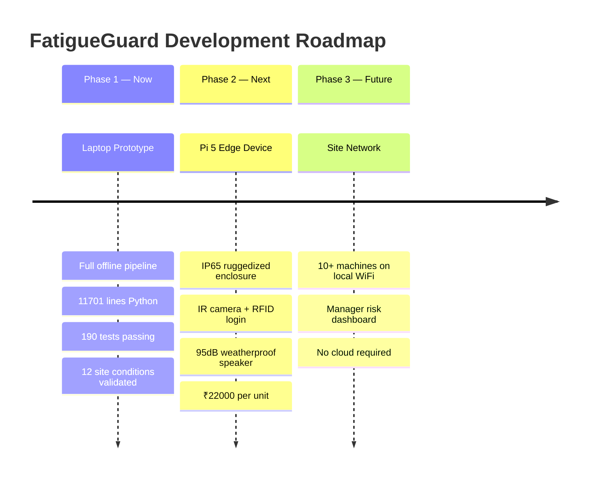

### Core Philosophy

> The fundamental insight that separates FatigueGuard from every threshold-based
> system: **alerts fire relative to each operator's personal calibrated baseline,
> not a population average.**

An operator with naturally narrow eyes does not get more false alerts.
An operator who arrives fatigued gets tighter thresholds, not easier ones.

---

## 3. 🛡️ Solution Overview

### Five-Thread Architecture

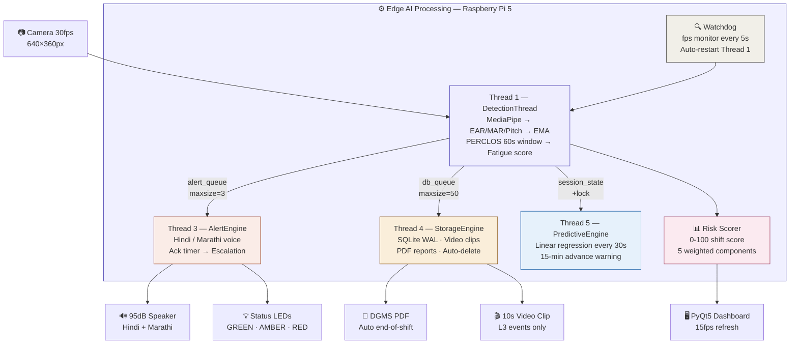

### Alert Level System

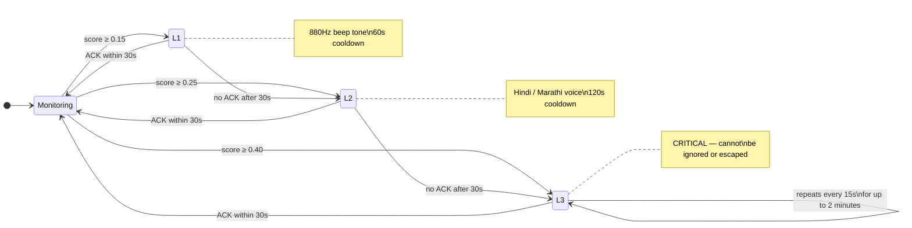

### 4 Unique Selling Points

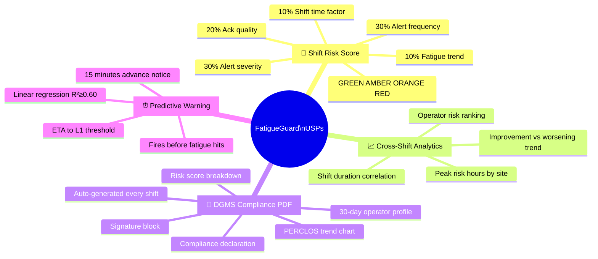

### Personal Baseline Calibration

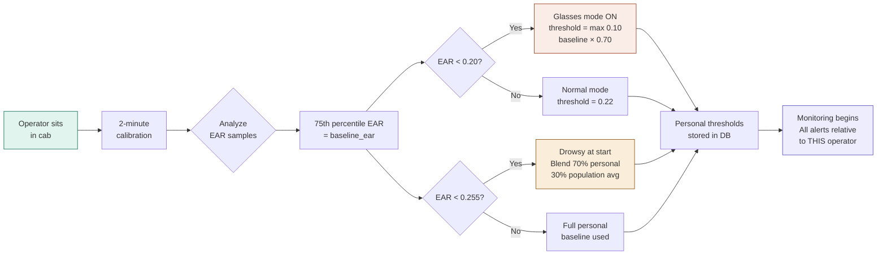

---

## 4. 💪 Challenges Faced

### Challenge 1 — Extreme Cab Vibration Makes EAR Useless

**Problem:** At 9-14Hz (rock crusher frequency), raw EAR oscillates between
`0.15` and `0.45` in a single second — the alert system fires and clears dozens
of times per minute on a perfectly alert operator.

**Solution:** Exponential Moving Average smoothing with `α = 0.15`, specifically
tuned for 9Hz excavator vibration.

```
smooth_EAR(t) = 0.15 × raw_EAR(t) + 0.85 × smooth_EAR(t-1)
Result: >50% noise reduction verified under 12Hz, 3× normal amplitude
```

---

### Challenge 2 — Glasses Wearers Get False L3 Alerts from Lens Glare

**Problem:** Sunlight reflecting off prescription lenses drops EAR to `0.05-0.08`
for the duration of the glare — triggering a critical L3 alert every time
the sun angle changes.

**Solution:** Two-layer glare gate with a **duration check**:

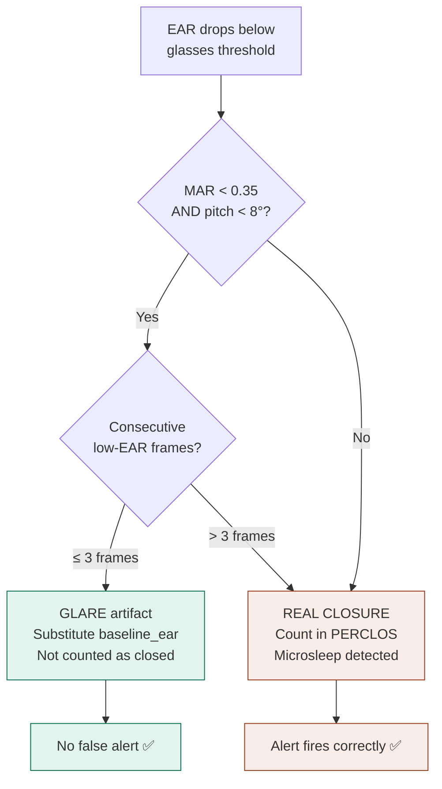

> **Test C9 discovery:** Without the duration check, microsleeps for glasses wearers
> were completely silent — zero alerts on deep sleep. Found by the harsh environment
> test suite before real deployment.

---

### Challenge 3 — Mid-Calibration Handover Contaminates Baselines

**Problem:** If Operator A ends their shift while Operator B's calibration is
still running, the calibration thread completes and writes **Operator A's baseline
into Operator B's database record**. Every alert for B's entire shift fires at
the wrong threshold. Silent, no error message, safety-critical.

**Fix:** Added `_interrupted` check inside `_collect_baseline()` loop,
polled every 0.1 seconds. Calibration now cancels cleanly within 100ms of handover.

---

### Challenge 4 — Glasses PERCLOS Threshold One-Size-Fits-All

**Problem:** Fixed glasses threshold `0.18` broke for operators with
`baseline_ear < 0.18` — their open eyes permanently sat below threshold.
PERCLOS hit 100% in 3 seconds → immediate L3 every session.

**Fix:**
```python
# Before (broken for low-EAR operators)
ear_threshold = 0.18

# After (personal, always correct)
ear_threshold = max(0.10, baseline_ear * 0.70)
# baseline=0.17 → threshold=0.119  ✅ well below open-eye EAR
# baseline=0.20 → threshold=0.140  ✅ correct for glasses wearer
# baseline=0.25 → threshold=0.175  ✅ correct for normal glasses
```

---

### Challenge 5 — SQLite Locks Under Concurrent Write Load

**Problem:** Thread 1, Thread 3, and Thread 4 all writing to SQLite
simultaneously caused `database is locked` errors under high load.

**Solution:** Isolated **all disk I/O to Thread 4** via `db_queue (maxsize=50)`.
Thread 1 never touches the disk. WAL mode serialises all writes.

**Verified:** 80 simultaneous writes across 4 threads → 0 lock errors < 5 seconds.

---

## 5. ⚙️ Technical Implementation

### Technology Stack

| Layer | Technology | Why Chosen |
|---|---|---|
| Computer Vision | MediaPipe FaceLandmarker (float16) | 3MB, CPU-only, 25-30fps on Pi5 |
| Feature Extraction | OpenCV 4.x + SciPy | EAR/MAR geometry, CLAHE |
| Fatigue Algorithm | Custom PERCLOS + EMA | Literature-validated, tunable |
| Prediction | NumPy linear regression | Appropriate for 20-point window |
| Database | SQLite 3 (WAL mode) | Embedded, zero-config, ACID |
| UI Framework | PyQt5 (Qt 5.15) | Offline, mature, cross-platform |
| Audio | pygame.mixer + gTTS | Pre-recorded MP3, zero latency |
| PDF | ReportLab + matplotlib | Professional compliance docs |
| Threading | Python threading module | 5 threads, queue communication |
| Language | Python 3.10+ | Rich ecosystem, rapid iteration |

### Detection Pipeline

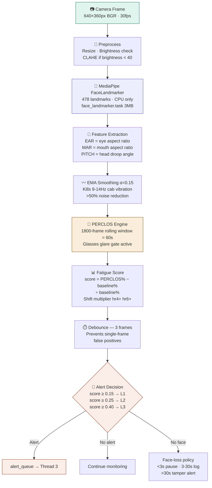

### Key System Constants

| Constant | Value | Purpose |
|---|---|---|
| PERCLOS window | **1800 frames (60s)** | Rolling eye-state history |
| EMA alpha | **0.15** | Vibration damping |
| Debounce frames | **3** | False-alert prevention |
| L1 threshold | **0.15** | Mild fatigue trigger |
| L2 threshold | **0.25** | Drowsy alert trigger |
| L3 threshold | **0.40** | Critical alert trigger |
| Ack timeout | **30 seconds** | Before escalation |
| Prediction horizon | **900s (15 min)** | Early warning window |
| Prediction min R² | **0.60** | Sustained trend gate |
| Calibration duration | **120 seconds** | Baseline collection |
| Fast-ack ceiling | **+0.05 EAR max** | Safety hard limit |
| Clip duration | **10s (5s pre+post)** | L3 evidence capture |
| Watchdog timeout | **15 seconds** | Camera stall detection |

### Database Schema

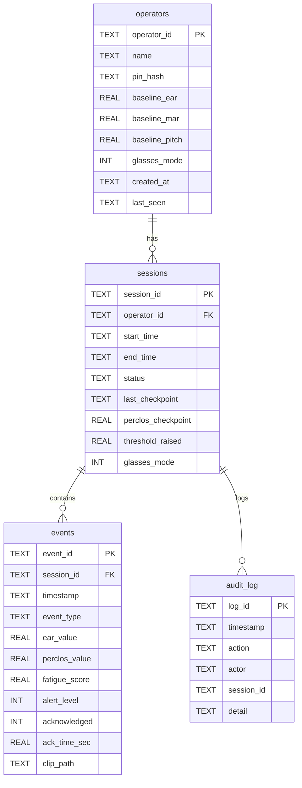

### Session Lifecycle

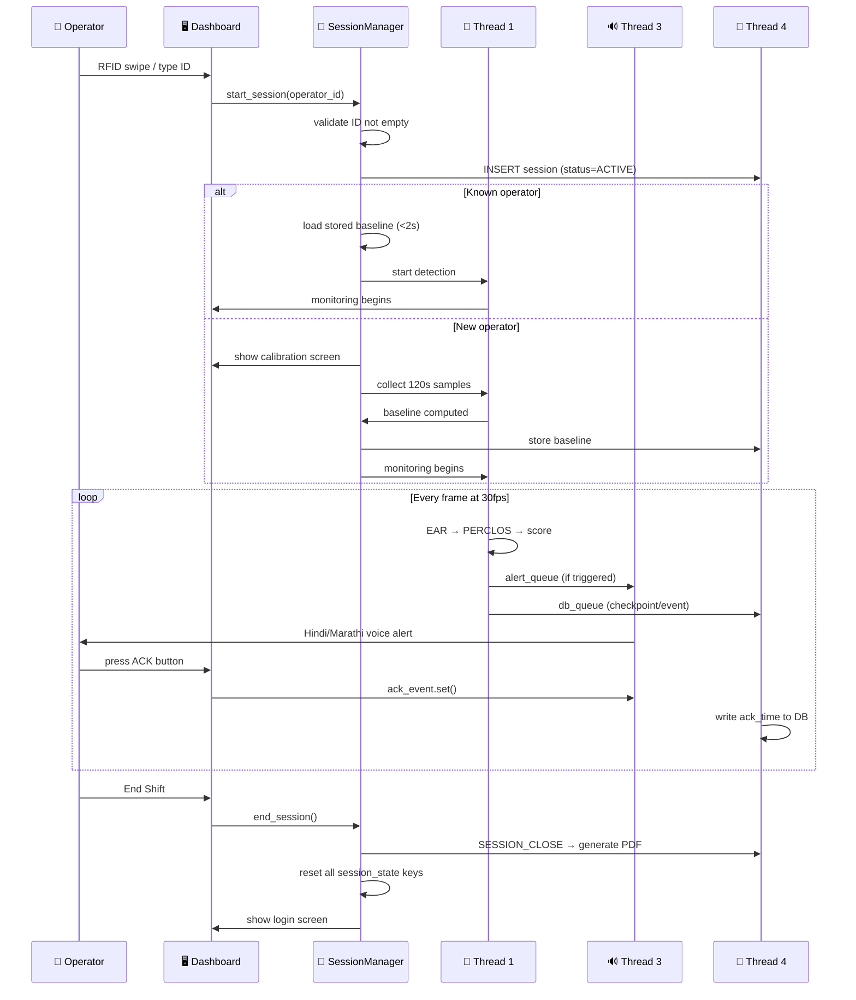

### Crash Recovery

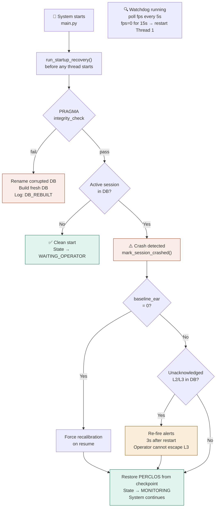

---

## 6. 🏆 Results & Achievements

### Performance Against Targets

| Metric | Target | Achieved | Status |
|---|---|---|---|
| End-to-end latency | < 300ms | **~61ms** | ✅ 4.9× better |
| False alerts under vibration | 0 | **0** | ✅ Verified 12Hz |
| False alerts from glare | 0 | **0** | ✅ All profiles |
| Microsleep detection (glasses) | Must detect | **Verified** | ✅ Post bug-fix |
| Concurrent DB writes | No locks | **80 writes, 0 errors** | ✅ < 5 seconds |
| Session handover (known op) | < 5 seconds | **< 2 seconds** | ✅ |
| 10-hour shift stability | No degradation | **All bounds held** | ✅ |
| Crash recovery — mid-L3 | Re-fire on restart | **Verified** | ✅ |
| PDF generation | Auto, every shift | **54-60KB** | ✅ DGMS-format |

### Test Suite — 190/190 Passing

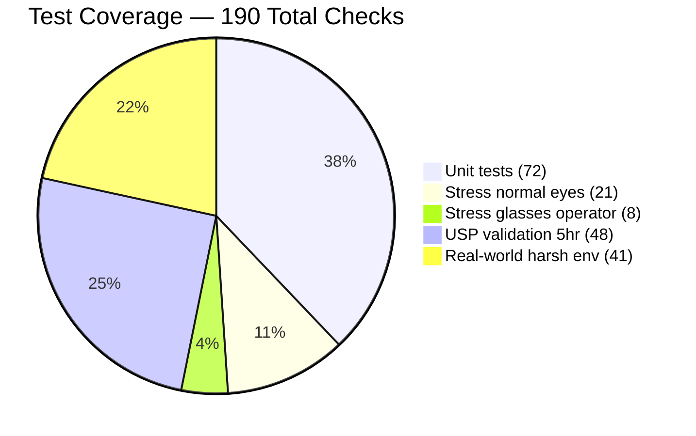

### Real-World Conditions — All 12 Validated

| # | Condition | Real Site | Outcome |
|---|---|---|---|
| C1 | Rock crusher 12-15Hz vibration | Granite quarry | ✅ 0 false alerts |
| C2 | Direct sunlight brightness >220 | Highway site 12:00-14:00 | ✅ No false alerts |
| C3 | Underground darkness brightness <15 | Singareni coal mine B-shift | ✅ PERCLOS < 20% |
| C4 | Hard hat + dust mask | Rajasthan stone quarry | ✅ Microsleep detected |
| C5 | 15 head turns in 3 minutes | Excavator loading cycle | ✅ 0 face-loss events |
| C6 | Camera lens fogs 35 seconds | Himachal Pradesh tunnel | ✅ Obstruction alert fires |
| C7 | Operator handover < 60 seconds | Continuous mine | ✅ No contamination |
| C8 | 10-hour extended shift | Indian site extended shifts | ✅ All bounds respected |
| C9 | Naturally low-EAR operator | ~15% Indian workforce | ✅ After bug fix |
| C10 | 5 rapid frustrated acks | Common site scenario | ✅ Ceiling held +0.05 |
| C11 | 80 simultaneous DB writes | L3 + clip + checkpoint | ✅ 0 lock errors |
| C12 | SD card < 200MB free | Pi card after 3 weeks | ✅ Graceful degradation |


### Project Scale

```
📦 11,701 lines of production Python
📁 24 modules across core/, ui/, scripts/, tests/
🧪 190 automated tests — all passing
🏗️  12 real-world site conditions validated
🐛 5 production bugs found and fixed before deployment
📄 3 documentation files (README + 2 architecture refs)
📊 4 system design diagrams (complete start-to-end)
⏱️  2-week sprint build
```

---

## 7. 🎬 Demonstration Guide

### Prerequisites — Run Once

```bash
# Install dependencies
pip install -r requirements.txt

# Download MediaPipe face model (3MB, internet needed once)
python scripts/download_model.py

# Generate Hindi/Marathi audio files
python scripts/generate_audio.py
```

### Start the System

```bash
python main.py
```

### Step-by-Step Demo for Panel

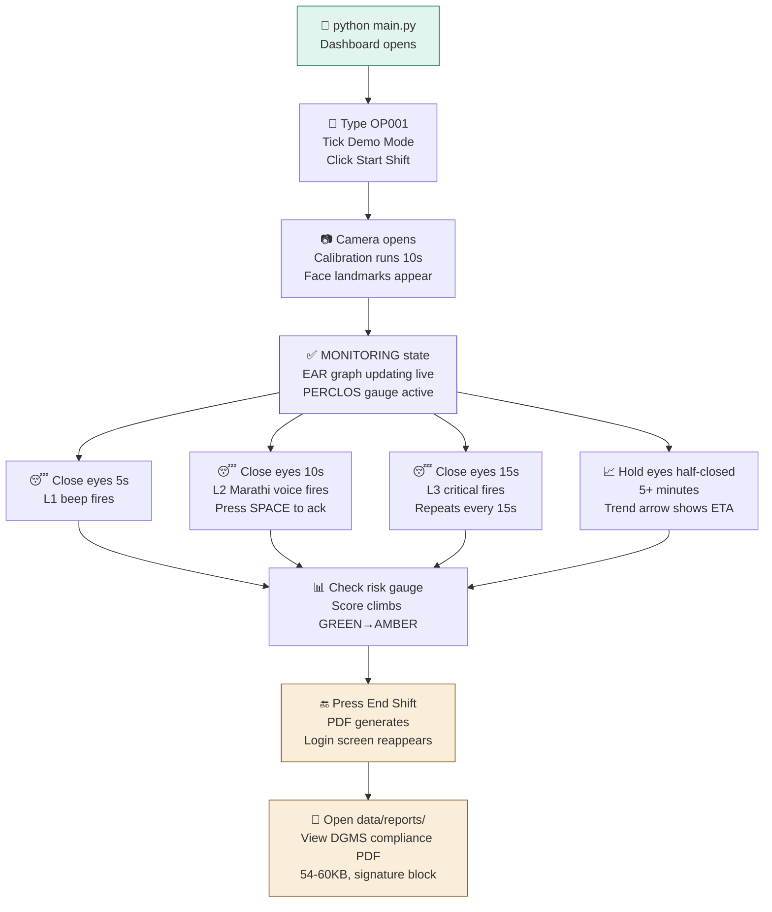

### Keyboard Controls

| Key | Action |
|---|---|
| `SPACE` | Acknowledge active alert |
| `D` | Toggle demo mode |
| `Q` | End shift + generate PDF + quit |
| `Ctrl+C` | Emergency shutdown |

### Running Tests

```bash
# Unit tests (< 10 seconds)
python tests/test_ear.py
python tests/test_perclos.py
python tests/test_audio.py

# Real-world validation (30 seconds, fast mode)
python tests/stress/test_realworld_harsh.py --fast

# 5-hour USP validation (30 seconds, fast mode)
python tests/stress/test_stress_usp_validation.py --fast

# Full 30-minute shift simulation
python tests/stress/test_stress_normal_eyes.py
```

---

## 8. 🚀 Future Enhancements

### Phase 2 — Raspberry Pi 5 Hardware Product

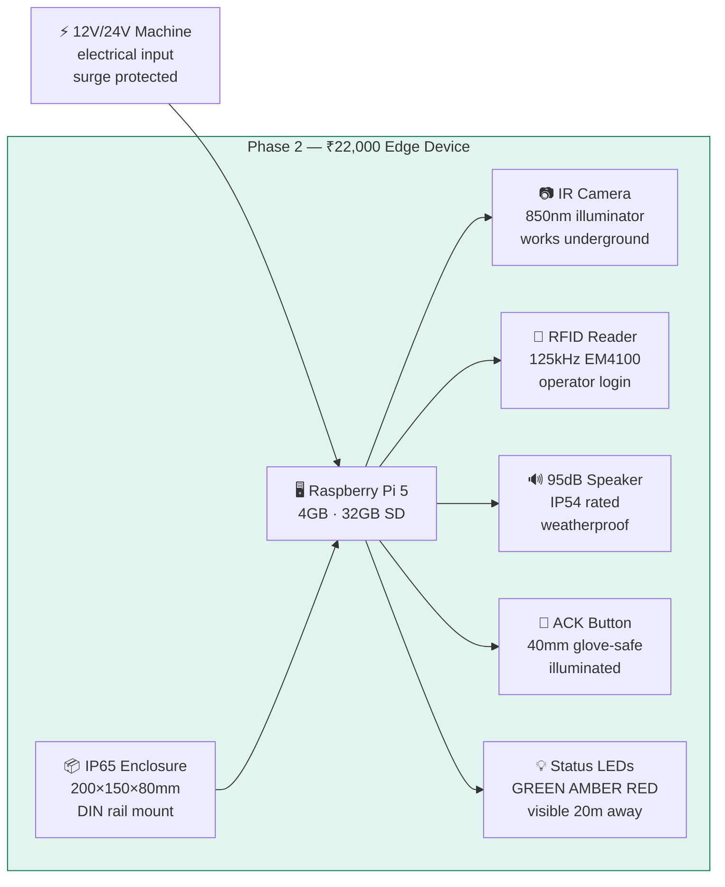

**One config change to migrate:**
```python
PLATFORM = "laptop"   # Phase 1 — now
PLATFORM = "pi5"      # Phase 2 — activates GPIO, Picamera2, RFID UART
```

### Phase 3 — Site Network Dashboard

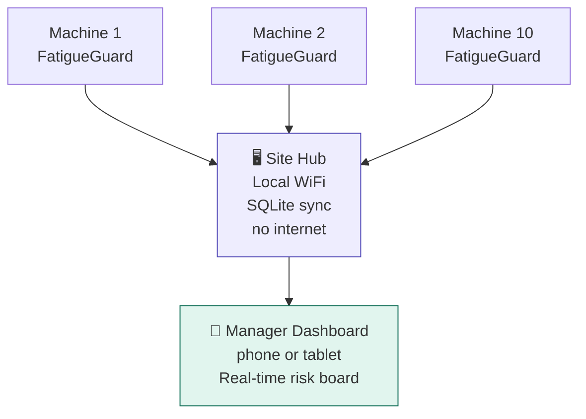

```
OP001  ████████  72  🔴 RED    Excavator 3
OP002  █████     31  🟡 AMBER  Crane 1
OP003  ██        12  🟢 GREEN  Dumper 7
```

### Additional Planned Enhancements

| Enhancement | Description | Impact |
|---|---|---|
| Night shift learning | Adjust thresholds for 3rd-week night rotation fatigue pattern | Reduces false negatives on night shifts |
| Machine-specific profiles | Tower crane vs dumper have different fatigue curves | Tighter per-machine accuracy |
| Supervisor mobile push | Local WiFi alert to supervisor phone when score goes RED | Faster supervisor response |
| CAN-bus integration | Reduce RPM or engage park lock on unacknowledged L3 | Removes human from safety chain |
| Bhojpuri + Tamil | 6 new MP3 files, zero code changes | Covers Bihar/UP + South India sites |
| Thermal camera fusion | FLIR Lepton fusion for dusty/extreme-heat conditions | Works where visible light fails |

---

## 📁 Repository Structure

```
fatigue_detection/
├── 📄 README.md                          ← This file
├── 📄 README_SOFTWARE_ARCHITECTURE.md   ← Full technical diagram reference
├── 📄 README_PHYSICAL_ARCHITECTURE.md   ← Hardware product design
├── ⚙️  config.py                          ← All 40+ system constants
├── 🚀 main.py                            ← Application entry point
├── 📋 requirements.txt                   ← Python dependencies
│
├── core/                                 ← 12 production modules
│   ├── database.py                       ← SQLite WAL · 5 tables
│   ├── state_machine.py                  ← 8 states · validated transitions
│   ├── detection.py                      ← Thread 1 · full pipeline
│   ├── calibration.py                    ← Personal baseline collection
│   ├── alert_engine.py                   ← Thread 3 · audio + escalation
│   ├── storage_engine.py                 ← Thread 4 · disk I/O isolation
│   ├── session_manager.py                ← Multi-operator lifecycle
│   ├── crash_recovery.py                 ← 4-scenario crash protection
│   ├── predictive_engine.py              ← Thread 5 · regression ETA
│   ├── risk_scorer.py                    ← USP 1 · 0-100 shift score
│   ├── analytics_engine.py               ← USP 2 · cross-shift SQL
│   └── report_generator.py               ← USP 3 · DGMS compliance PDF
│
├── ui/                                   ← 4 PyQt5 modules
│   ├── dashboard.py                      ← Main window · 15fps refresh
│   ├── widgets.py                        ← EAR graph · PERCLOS gauge
│   ├── login_screen.py                   ← Operator ID entry
│   └── calibration_screen.py             ← Progress bar overlay
│
├── scripts/
│   ├── download_model.py                 ← One-time: MediaPipe model
│   └── generate_audio.py                 ← One-time: Hindi/Marathi MP3
│
├── tests/
│   ├── test_ear.py                       ← 18 checks
│   ├── test_perclos.py                   ← 24 checks
│   ├── test_audio.py                     ← 30 checks
│   └── stress/
│       ├── scenario_generator.py         ← Synthetic fatigue patterns
│       ├── stress_harness.py             ← Real-thread injection
│       ├── test_stress_normal_eyes.py    ← 21 checks
│       ├── test_stress_glasses_operator.py ← 8 checks
│       ├── test_stress_usp_validation.py ← 48 checks · 5-hour test
│       └── test_realworld_harsh.py       ← 41 checks · 12 conditions
│
└── assets/
    ├── face_landmarker.task              ← MediaPipe model (download once)
    └── audio/                            ← Hindi + Marathi MP3 files
```

---

<div align="center">

## Built in Maharashtra, India

**For Indian operators · In their language · For their machines**
**At a price Indian contractors can actually afford**

<br/>

```
11,701 lines · 190 tests · 12 site conditions · 5 bugs fixed before deployment
₹22,000/unit · 7× cheaper · 100% offline · DGMS compliant
```

<br/>

*FatigueGuard POC*

</div>
